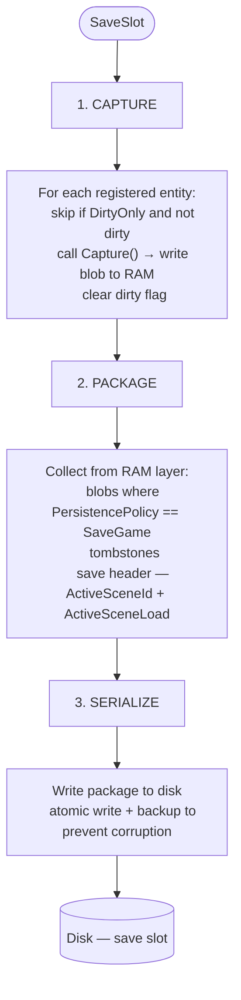
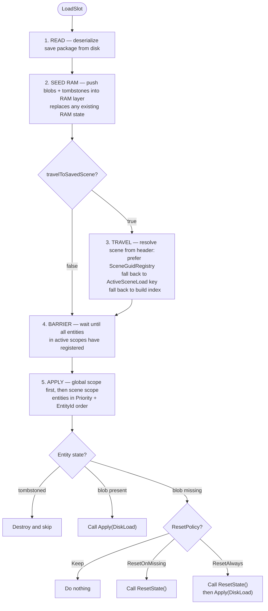
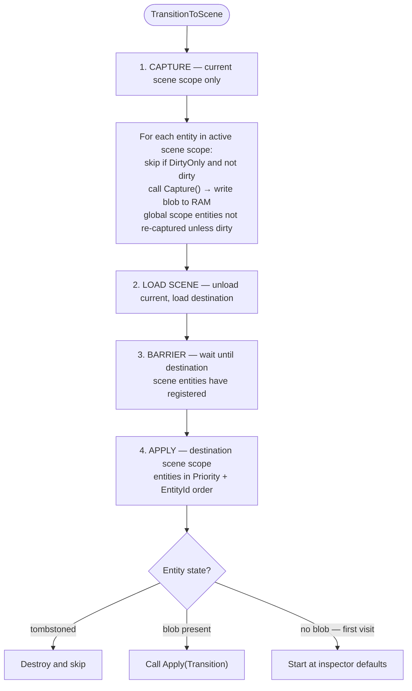
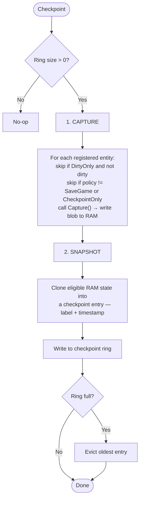
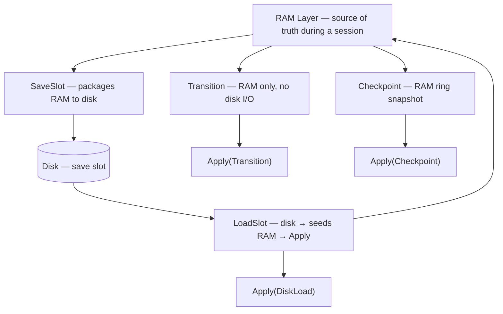

# Architecture

This document maps the end-to-end pipeline for every major operation CrowSave runs: **manual save**, **load game**, **scene transition**, and **checkpoint**.

For concepts (scopes, identity, blobs, policies) see [Overview](overview.md). For authoring entities see [Persistence](persistence.md).

---

## Two storage layers

Every pipeline operates across one or both of CrowSave's storage layers.

| Layer | Lives in | Speed | Survives quit | Purpose |
|---|---|---|---|---|
| **RAM layer** | Memory | Fast | No | In-session source of truth. Used for transitions and backtracking. |
| **Disk layer** | Save files | Slower | Yes | Durable snapshots. Manual saves, checkpoints, load-game. |

Blobs and tombstones written to the RAM layer are the working state during a session. The disk layer is only read on load and written on save.

---

## Orchestration rules

These rules apply to every operation:

- **One operation at a time.** If `SaveOrchestrator.IsBusy`, new calls are refused.
- **Time scale is frozen** during ops when `SaveConfig.freezeTimeScaleDuringOps` is enabled.
- **Global scope is applied before scene scope** during any apply phase.
- **The barrier always runs before Apply.** It waits until all entities in the target scope have registered before any `Apply()` is called.
- **Apply order is stable**: entities are applied in `(Priority, EntityId)` order, eliminating timing-dependent bugs.

---

## Manual save

Persists the current session state to a named slot on disk.

**What gets written:** only entities with `PersistencePolicy.SaveGame`. `SessionOnly` and `CheckpointOnly` entities are excluded.

---

## Load game

Reads a slot from disk and restores the world. Optionally travels to the scene that was active when the save was made.

**Travel is optional.** Pass `travelToSavedScene: false` to restore state into the current scene without loading a new one. The default behavior follows `SaveConfig.loadScenePolicy`.

---

## Scene transition

Captures the current scene to RAM, loads the destination, then restores it. This is the standard in-session scene change — no disk I/O.

**ApplyReason is `Transition`**, not `DiskLoad`. Entities can branch on this — for example, skipping transform restoration on a transition that the scene layout already handles.

**First visit** to a scene produces no blob for that scope. Entities that have never been captured start at their inspector defaults.

---

## Checkpoint

Writes a snapshot to a rotating ring in RAM (and optionally to disk). Used for "rewind to last safe point" flows.

**Restoring a checkpoint** follows the same Read → Seed RAM → Barrier → Apply pattern as a disk load, with `ApplyReason.Checkpoint` passed to `Apply()`.

**Ring size of 0** disables checkpoints. Calling `Checkpoint()` when the ring size is 0 is a no-op.

---

## How the pipelines relate

- **Transitions** work entirely in RAM — fast, no disk I/O, no durability.
- **Checkpoints** snapshot RAM state into a ring — fast, in-memory, bounded history.
- **SaveSlot** packages eligible RAM state to disk — durable, survives quit.
- **LoadSlot** is the only operation that reads from disk. It seeds the RAM layer before applying, so the session is fully live again after it completes.

---

## Barrier in detail

The barrier is the synchronization point before every Apply phase.

**Why it exists:** entities register themselves during `OnEnable`. Scene loads are asynchronous — if Apply ran immediately after the load, some entities might not have registered yet, causing their state to be silently skipped.

**What it does:** the orchestrator waits one or more frames after the scene load completes until the registry reports that all expected entities in the target scope have checked in. Only then does Apply begin.

**What "registered" means:** the entity's `PersistentMonoBehaviour` (or equivalent) has called its registration method, making it visible to the capture/apply engine.

If an entity is disabled or destroyed before the barrier clears, it will not receive `Apply()`. This is intentional — tombstones handle the destroyed case explicitly.